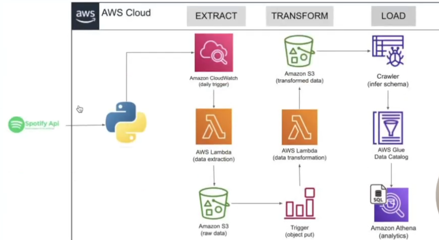

# Spotify Data Pipeline

## Overview
This project aims to create a fully automated data pipeline that extracts data from the Spotify API, transforms it, and stores it in Amazon S3. The goal is to enable efficient analytics through AWS Glue and AWS Athena.
## Data Pipeline

## Project Steps
1. **Integrating with Spotify API and extracting data**
2. **Deploying code on AWS Lambda for data extraction**
3. **Adding a trigger to run the extraction automatically**
4. **Writing transformation functions**
5. **Building automated triggers for the transformation functions**
6. **Storing files in S3 properly**
7. **Building analytics tables on data files using AWS Glue and Athena**

## Services We Will Be Using

### Amazon S3
Amazon S3 is an object storage service that provides industry-leading scalability, data availability, security, and performance.

### AWS Lambda
AWS Lambda is a serverless compute service that lets you run code for various applications or backend services without provisioning or managing servers.

### AWS IAM
AWS Identity and Access Management (IAM) enables you to manage access to AWS services and resources securely.

### AWS Glue
AWS Glue is a serverless data integration service that makes it easy to discover, prepare, and combine data for analytics, machine learning, and application development.

### AWS Athena
AWS Athena is an interactive query service that makes it easy to analyze data in Amazon S3 using standard SQL.

### Diagrams.net
Diagrams.net is a free online diagram software for creating flowcharts.

### Spotify API
We will use the Spotify API to extract data related to music tracks, artists, and playlists.

- [Spotify API Documentation](https://developer.spotify.com/)
- Playlist Link: [Spotify Playlist](https://open.spotify.com/playlist/37i9dQZEVXbMwW10JmAnzE)

## Getting Started

### Prerequisites
- An AWS account
- Access to the Spotify Developer Dashboard
- Basic knowledge of Python and AWS services

### Usage
1. Set up AWS Lambda functions for data extraction and transformation.
2. Configure IAM roles and policies to allow access to necessary AWS services.
3. Create and configure S3 buckets for data storage.
4. Deploy the code and set up automated triggers for the Lambda functions.
5. Use AWS Glue to create crawlers and catalog tables.
6. Use AWS Athena to query the data stored in S3.

